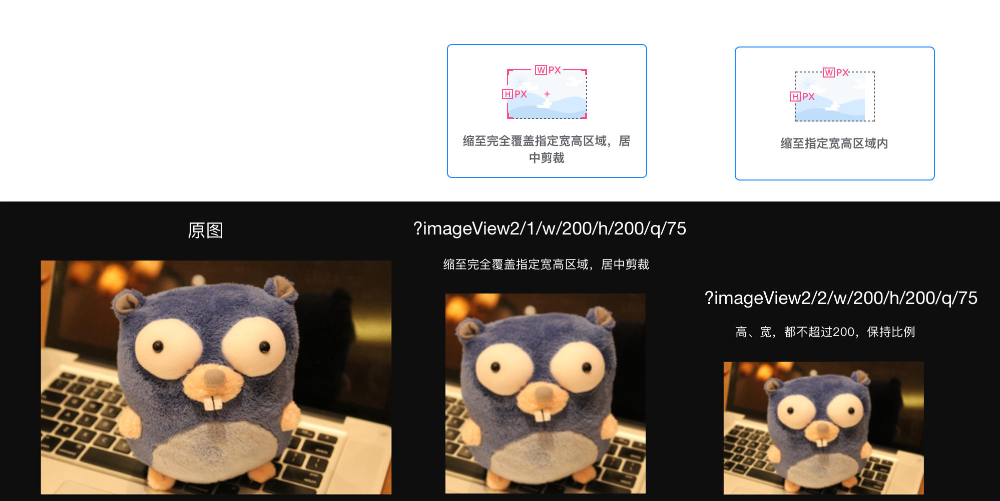

# 使用说明

**这是一个单机版的简单OSS系统，使用docker部署（docker-compose已带nginx），可绑定域名+SSL。**

#### 功能特征：

1、支持form post方式上传图片，有权限控制；

2、可以像七牛云那样支持图片缩放、剪裁；

#### 支持的剪裁、缩放指令有：

1、`?imageView2/2/w/100/h/100/q/75` （缩至指定宽高区域内）

2、`?imageView2/1/w/100/h/100/q/75`（缩至完全覆盖指定宽高区域，居中剪裁）

**缩放、剪裁的指令使用方法完全和七牛云一样，但仅包含以上两个最常用的指令（基本足够用了），其它的指令后续再添加。**

### 部署方式：

**1、执行：**

`git clone https://github.com/soyojoearth/newxton_oss.git`

`docker-compose -f docker-compose-oss.yml up `

**2、然后向以下地址，按照如下的参数上传图片：**

`http://服务器IP:8079/upload/public_pic`

**Form-data:**

`file:表单上传文件`

`Secret-Key:83lgvkHJU23`

**3、使用以下地址显示图片：**

`http://服务器IP:8079/上传图片后返回的图片路径`（显示原图）

``http://服务器IP:8079/上传图片后返回的图片路径?imageView2/2/w/100/h/100/q/75``（缩小到宽100高100质量75）

例如：`http://58.243.12.4:8079/2020/09/23/1729321146.png?imageView2/1/w/90/h/150/q/75`

#### 绑定域名+配置SSL：（可跳过1、2测试步骤）

##### **1、配置自己的图片域名：**

修改`http`目录中`nginx.conf`域名绑定：

`server_name  test-oss.newxton.com;`（这里换成你的图片域名）

http目录中的2个证书文件：

`oss_ssl_cert.pem`、`oss_ssl_cert.key`

请换成你的域名对应ssl证书文件

##### 2、重启docker-compose，然后使用你的域名访问：

`https://你的图片域名/上传图片后返回的图片路径`（显示原图）

``https://你的图片域名/上传图片后返回的图片路径?imageView2/2/w/100/h/100/q/75``（缩小到宽100高100质量75）

